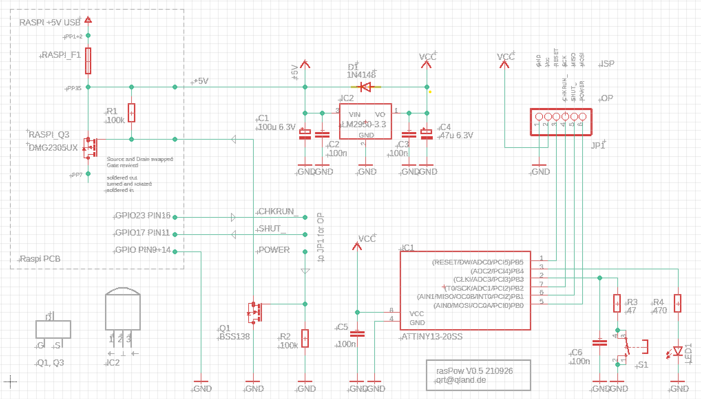

# **PC-Style Raspberry Power Switch**

## A 'real' power switch for the Raspberry Pi

<br>

### **Function**
Initially the Raspberry is cut from 5 V USB supply, power is established after the push button on the ATTINY microcontroller is pressed. The controller detects if Raspberry OS is completely booted, then a anew button press will shutdown Raspberry OS safely. The controller detects if the Raspberry is completely shutdown and disconnect it from power after some seconds. If Raspberry OS does not respond in any way, a long button press, like on PC power buttons, will cut the power and allow to restart again.

<br>

### **Assembly**
Easiest, without soldering on the Raspberry PCB and applicable for all Raspberry versions, is to integrate an adequate P-Channel MOSFET (like IRLML6402) to the Micro USB power cable of the Raspberry, the cable might be ripped up or some kind of adapter or plug extension must be constructed. The additional MOSFET in the power cable might lead to under voltage messages of Raspberry OS, which should normally be no problem.

For Raspberry versions <4 fuse F1 can be desoldered and replaced by an adequate P-Channel MOSFET (like IRLML6402), to not loose overcurrent protection the fuse might be reused in front the MOSFET.

For Raspberry version 3 MOSFET Q3 can be utilized, but it has to be desoldered, newly orientated and soldered in again. The polarity protection Q3 normally provides is lost by this process, also some SMD soldering experience is required. Source and Drain of Q3 have to be swapped, it is best to turn it upside down and rotate it to match the corresponding PCB pads. The Gate pad stays open, the Gate of Q3 has to be wired to the Drain of Q1.

<br>

### **Raspberry Software**
Edit a new file in your home directory  
`nano shutdown.py`

Adapt it to your GPIO wishes
```
##! /usr/bin/env python
import os
import RPi.GPIO as GPIO

SHUT_ = 17      # GPIO17 pin 11 as input with pullup for shutdown
CHKRUN_ = 23    # GPIO23 pin 16 as output LOW for run check

GPIO.setmode(GPIO.BCM)
GPIO.setup(SHUT_, GPIO.IN, pull_up_down=GPIO.PUD_UP)
GPIO.setup(CHKRUN_, GPIO.OUT, initial=GPIO.LOW)

try:
    while True:
        GPIO.wait_for_edge(SHUT_, GPIO.FALLING)
        os.system("/sbin/shutdown -h now")
except:
    GPIO.cleanup()
```

Test with  
`sudo python3 shutdown.py`

For auto start  
`sudo nano /etc/crontab`

Add a new crontab at the end of the file
```
@reboot root /usr/bin/python /home/pi/shutdown.py
```

<br>

### **Controller Software**
The assembler file is meant for a ATTINY 13 controller, the fuse settings can be found in the comments. A ready assembled hex file is attached.

LED1 signals the state of operation
| Signal     | Operation | Raspberry Power |
|------------|-----------|-----------------|
| `.......*` | standby   | off             |
| `.*.*.*.*` | boot      | on              |
| `********` | running   | on              |
| `...*...*` | shutdown  | on              |

<br>

### **Schematic**
The version utilizing Q3 on Raspberry PCB is shown, the 'Raspi PCB' named part must be adapted analogous for cable ripping or replacing F1 variants. 

CHKRUN_  
On Raspberry OS start the installed shutdown.py script makes this GPIO pin an output and sets it to low, after a shutdown the line begins to float. The ATTINY controller decides the Raspberry to be fully operational if the line is stable low, if the controller can pull up the floating line to high the Raspberry must be shut down.

SHUT_  
The shutdown.py script configures this pin a pulled up input and then waits for a low to shut down the Raspberry safely.

POWER  
The ATTINY controller uses this line to switch the Raspberry's supply via MOSFET Q1 and Q3.

JP1  
In 'ISP' (ICSP) mode the connector allows programming the controller 'in circuit' with a suitable device. In operational 'OP' mode JP1 is connected according the schematic to CHKRUN_, SHUT_ and POWER.

IC2  
Because of the unsteady 5 V supply on the end of USB-cables a 3.3 V voltage regulator supplies the ATTINY controller. It also saves level shifting between Raspberry and controller in- and outputs.

R1  
Guarantees the Raspberry is controlled powered off before the ATTINY controller has started (when supply voltage rises) or the controller is disconnected.

<br>



<br>
<br>

---

[qrt@qland.de](mailto:qrt@qland.de) 210930
